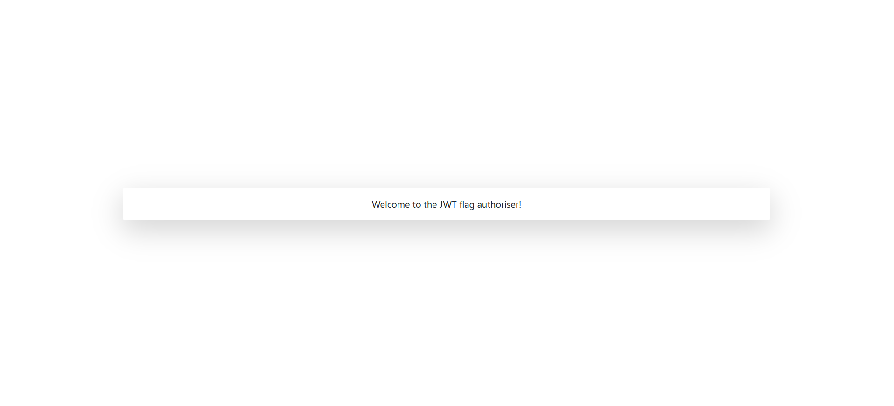
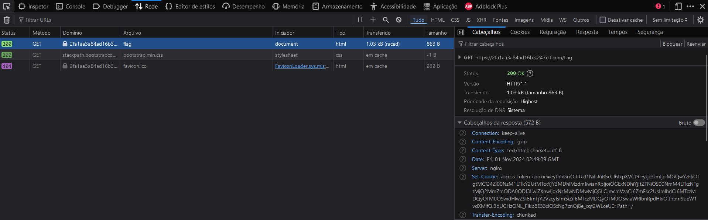
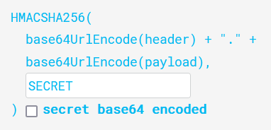
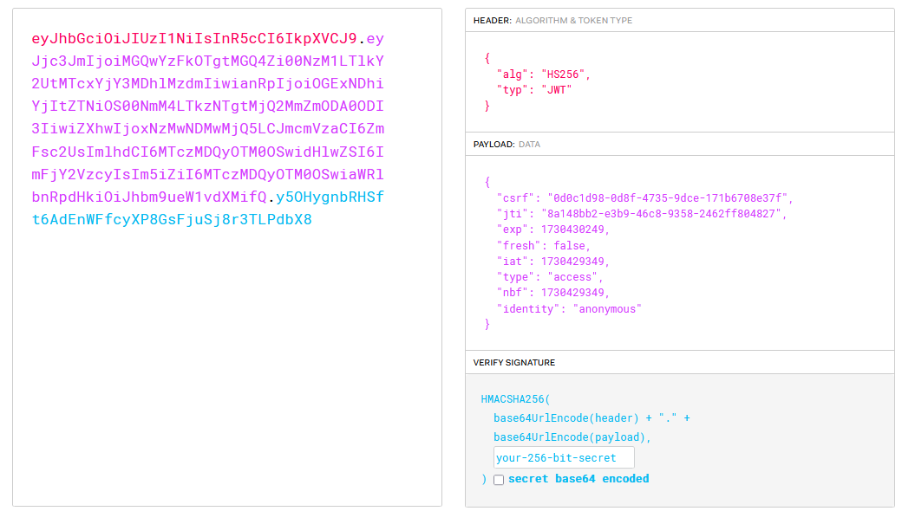
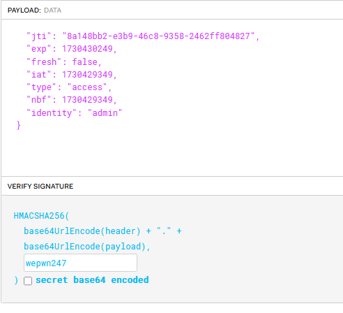
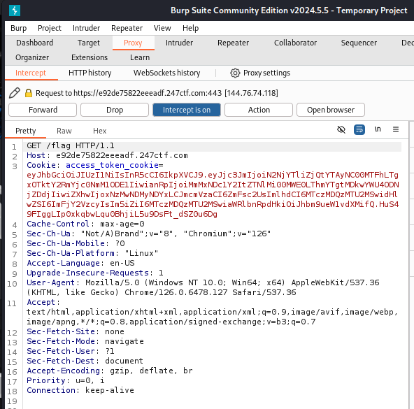

# Flag Authoriser

Esse CTF consiste em uma exploração do sistema de cookies do JWT.

## Cookies JWT

Primeiramente, para entender o pedido para o desafio, temos que entender o que nos é proposto.

O desafio nos dá o seguinte site:

```php
from flask import Flask, redirect, url_for, make_response, render_template, flash
from flask_jwt_extended import JWTManager, create_access_token, jwt_optional, get_jwt_identity
from secret import secret, admin_flag, jwt_secret

app = Flask(__name__)
cookie = "access_token_cookie"

app.config['SECRET_KEY'] = secret
app.config['JWT_SECRET_KEY'] = jwt_secret
app.config['JWT_TOKEN_LOCATION'] = ['cookies']
app.config['DEBUG'] = False

jwt = JWTManager(app)

def redirect_to_flag(msg):
    flash('%s' % msg, 'danger')
    return redirect(url_for('flag', _external=True))

@jwt.expired_token_loader
def my_expired_token_callback():
    return redirect_to_flag('Token expired')

@jwt.invalid_token_loader
def my_invalid_token_callback(callback):
    return redirect_to_flag(callback)

@jwt_optional
def get_flag():
    if get_jwt_identity() == 'admin':
        return admin_flag

@app.route('/flag')
def flag():
    response = make_response(render_template('main.html', flag=get_flag()))
    response.set_cookie(cookie, create_access_token(identity='anonymous'))
    return response

@app.route('/')
def source():
    return "

%s

" % open(__file__).read()

if __name__ == "__main__":
    app.run()

```

Analisando o código é notável as únicas duas rotas usadas no site: "/" e "/flag". Nota-se que o funcionamento do site se baseia fortemente em Cookies e que eles são formados via JWT (JSON Web Tokens) Além disso, vemos que no trecho `@jwt_optional`, existe uma flag de admin em destaque:

```php
@jwt_optional
def get_flag():
    if get_jwt_identity() == 'admin':
        return admin_flag
```

Ou seja, nosso objetivo é mostrar ao site que somos administradores.
Para isso, tentamos acessar a rota "/flag". Nela, somos apresentados com uma página com uma caixa:



Acessando a aba de *requests* do modo de desenvolverdor, vemos podemos ver um Cookie na request de load da página



Ao colocarmos o Cookie da página num [analisador de JWT](https://jwt.io/), vemos o seguinte JSON:

```json
{
  "csrf": "0d0c1d98-0d8f-4735-9dce-171b6708e37f",
  "jti": "8a148bb2-e3b9-46c8-9358-2462ff804827",
  "exp": 1730430249,
  "fresh": false,
  "iat": 1730429349,
  "type": "access",
  "nbf": 1730429349,
  "identity": "anonymous"
}
```

Naturalmente, a ideia é mudar o campo "identity" para "admin". No próprio site do https://jwt.io/ é possível pegar o novo Cookie ao mudar o campo.

Usando uma ferramenta de Proxy (no caso, o proxy usado foi o do Burp Suite), modificamos a request feita com o novo Cookie, no campo da request e a reenviamos. Porém existe um erro.

O sistema indica que o token de sessão não está autenticado. Isso significa que, para o flask, o novo JWT gerado é invalido.

Isso ocorre pois o algoritmo de formação do token JWT ocorre usando o seguinte algoritmo, para essa situação:



Isso era perceptível no código fonte original quando o Flask chama um valor de "secret", em um dos primeiros cabeçalhos. Dessa forma, precisamos achar uma secret que gera o código original. Para isso, vamo usar o maior cracker de criptografias: John The Ripper.

Esse aplicativo é um cracker do Kali Linux que, colocando uma word list, o arquivo criptografado e o método de criptografia, retorna (por força-bruta) a palavra-senha.

Assim, usando uma das mais completas word lists que existe, rockyou.txt, que também está no Kali, executaremos o seguinte comando:

```bash
$ john jwt.txt --wordlist=rockyou.txt --format=HMAC-SHA256
```

Onde o arquivo jwt.txt contém o Cookie original do site.

Com algumas tentativas, o comando retorna a seguinte string: "wepwn247", que é a secret.

Finalmente, voltamos ao https://jwt.io/ e colocamos o Cookie original novamente:





E modificamos o campo "identity" para "admin" e a secret, lá embaixo, para "wepwn247":



Agora, pegamos o novo Cookie gerado e colocamos novamente na nossa ferramenta de proxy e enviamos os dados:



Pronto! O site retorna a flag desejada.
